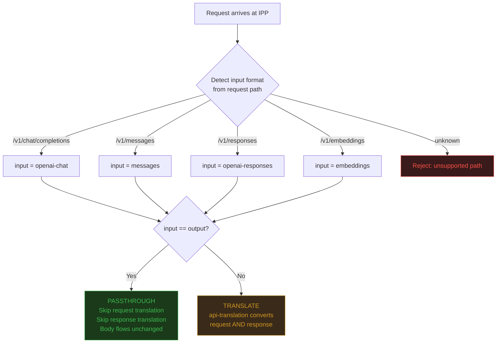
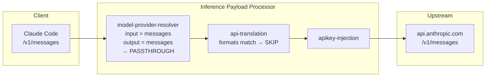
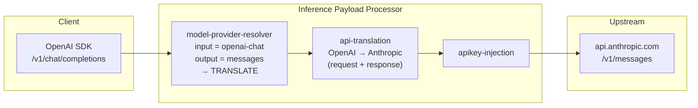

# Design: Multi-API Passthrough for External Model Serving

## Status

Draft — June 2026

## Author

Inference Gateway Team

## Problem Statement

The IPP assumes all client requests arrive in OpenAI `/v1/chat/completions` format. The `api-translation` plugin translates to the upstream provider's format and back. This breaks when clients speak their provider's native format directly — translation strips provider-specific features (prompt caching, extended thinking, beta flags) that have no equivalent in the canonical format.

The design should support **any** API format, not just text inference. Embeddings, audio, images, and future APIs should all be passthrough-capable without code changes to the passthrough logic.

## Proposed Solution

### Input/Output API Format Matching

The IPP detects the **input API format** from the request path and compares it to the **output API format** declared on the ExternalModel CR. When they match, both request and response translation are skipped.

```
Client (Anthropic) → /v1/messages    → input = "messages"
                                       output = "messages" (from ExternalModel.apiFormat)
                                       MATCH → passthrough (no translation)

Client (OpenAI)    → /v1/chat/completions → input = "openai-chat"
                                            output = "messages" (Anthropic upstream)
                                            MISMATCH → translate (existing behavior)
```

### Format Detection

The input format is detected from the request path suffix. This mapping is generic — adding new API formats requires only a new entry here:

| Path suffix | Detected format | API |
|-------------|----------------|-----|
| `/v1/chat/completions` | `openai-chat` | OpenAI Chat Completions |
| `/v1/messages` | `messages` | Anthropic Messages |
| `/v1/responses` | `openai-responses` | OpenAI Responses |

Adding new formats (e.g., `/v1/embeddings` → `embeddings`) requires only a new case in `detectInputAPIFormat()` — no changes needed in `isPassthrough()` or api-translation.

The output format comes from `ExternalProviderRef.apiFormat` on the ExternalModel CR, or is derived from the legacy provider name:

| Legacy provider | Output format |
|----------------|---------------|
| `anthropic` | `messages` |
| `openai` | `openai-chat` |
| `azure-openai` | `openai-chat` |
| `bedrock-openai` | `openai-chat` |
| `vertex-openai` | `openai-chat` |

### CycleState Flow

The model-provider-resolver writes two keys to CycleState:

- `input-api-format` — detected from request path (e.g., `"messages"`)
- `output-api-format` — from ExternalModel's apiFormat (e.g., `"messages"`)

The api-translation plugin reads both. If they match, both request AND response translation are skipped.

### Decision Flow



### Passthrough Flow (input format matches output format)



### Translation Flow (input format differs from output format)



## Changes Required

### IPP (ai-gateway-payload-processing)

| Component | Change |
|-----------|--------|
| `pkg/plugins/common/state/state-keys.go` | Add `InputAPIFormatKey` and `OutputAPIFormatKey` |
| `pkg/plugins/model-provider-resolver/store.go` | Add `apiFormat` field to `externalModelInfo` |
| `pkg/plugins/model-provider-resolver/external_model_reconciler.go` | Populate `apiFormat` — legacy CRDs: derive from provider name via `providerToAPIFormat()`. New CRDs: read from `ExternalProviderRef.apiFormat` |
| `pkg/plugins/model-provider-resolver/plugin.go` | Detect input format from path via `detectInputAPIFormat()`, accept `/v1/messages`, `/v1/responses`, `/v1/embeddings`. Write both format keys to CycleState |
| `pkg/plugins/api-translation/plugin.go` | Extract `isPassthrough()` helper. Skip both request AND response translation when input format matches output format |

### MaaS (models-as-a-service) — Required for Production

| Component | Change | Why |
|-----------|--------|-----|
| MaaS AuthPolicy template | Support configurable auth header names | Claude Code sends key in `x-api-key` header. Current AuthPolicy only supports `Authorization: Bearer`. Should be generalized to support any header name per provider, not just Anthropic's `x-api-key` |
| MaaS HTTPRoute generation | Add URLRewrite filter with `ReplacePrefixMatch: /` | Provider APIs must receive clean paths, not MaaS-prefixed paths |

### BBR Framework (llm-d-inference-payload-processor)

| Component | Change |
|-----------|--------|
| `pkg/handlers/response.go` | Parse SSE streaming responses for usage extraction |
| `pkg/handlers/server.go` | Acknowledge non-EoS response body chunks in streaming mode |

Tracked in upstream PR #138.

## Extensibility

Adding support for new API formats (embeddings, audio, images, conversations) requires:

1. **One line** in `detectInputAPIFormat()` — map the path suffix to a format name
2. **No changes** to `isPassthrough()` — the format matching is generic
3. **No changes** to `api-translation` — passthrough works for any format pair

This means the gateway can support any API that a provider exposes, as long as the client and upstream speak the same format.

## Backward Compatibility

- Fully backward compatible. Existing OpenAI-only deployments are unaffected.
- If `InputAPIFormatKey` is not set in CycleState, api-translation behaves exactly as before.
- Model mismatch validation is preserved — request body `model` must match `ExternalModel.targetModel`.

## OpenAI Chat Exclusion

The `openai-chat` format is excluded from passthrough even when input and output match. This is because the OpenAI translator performs essential `:path` rewriting — it strips the model prefix path (e.g., `/llm/model/v1/chat/completions` → `/v1/chat/completions`) which is needed for the upstream provider to receive a clean path. For non-OpenAI formats, path rewriting is handled by the HTTPRoute URLRewrite filter.

## Known Limitations

- **NeMo guardrails in passthrough mode:** When passthrough is active for non-OpenAI formats (e.g., Anthropic Messages), the NeMo response guard's `extractAssistantMessages()` looks for a `choices` array (OpenAI format) which doesn't exist in Anthropic responses. The guard silently returns nil and the response passes without inspection. Deployments using NeMo response guards alongside passthrough should be aware that guardrail inspection only applies to OpenAI-format responses.

## Out of Scope

- Model override / transparent model swapping (separate feature)
- Parameter normalization across model tiers (separate feature)
- External metering / usage tracking (separate PR)
- New provider translation plugins (api-translation scope)
- Unified entry point / body-based routing (RHAISTRAT-1540)
